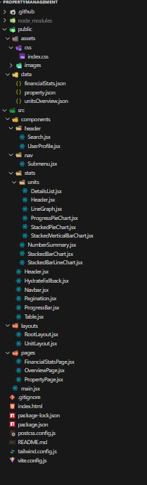

# Proptely

Proptely is a modern web application designed to manage and showcase properties effectively.

## Implemented Features

- **Properties Page**: Display properties table by fetching from local json data file in the components respective loader.
- **Mock API**: Using react router loaders for fetching local json data.
- **Pagination**: Efficiently navigate through large datasets by splitting them into pages.
- **Progress Bar**: Indicates the progress of data displayed across multiple pages, providing users with a visual cue for tracking their navigation and engagement with the dataset.
- **Accessible Design**: Fully optimized for screen readers and follows accessibility best practices (e.g., ARIA labels).
- **Responsive Design**: Adaptable for various devices and screen sizes.
- **Interactive UI**: Implemented effective state management for dynamic and interactive user experiences, e.g. navigation dropdown, pagination and data rows per page.
- **Reusable components**: Example search box, progress bar, table, pagination, Navbar and Submenu dropdown components
- **Financial stats page**:
  _Note: While I was in the process of developing the Financial Stats page, the Figma file was updated after the extension was provided. As a result, I developed the Units page based on the updated Figma file, and was able to partially complete the Financial Stats page._
- **Units Page**: Developed the entire units page. Made all different types of charts like line chart, bar chart, and pie chart displaying the fetched data through interactive graphs and tables.

## Technologies Used

- **Vite**: For fast bundling and development.
- **React**: For building the user interface.
- **Tailwind CSS**: For styling and responsive design.
- **React-Paginate**: For implementing efficient pagination functionality.
- **React Router**: For implementing routing.
- **recharts**: For implementing chart and graphs.

## Installation

1. Clone the repository:
   ```bash
   git clone https://github.com/Noha-5/proptely.git
   ```
2. Navigate to the project directory:

   ```bash
   cd proptely
   ```

3. Install dependencies:

   ```bash
     npm install
   ```

4. Start the development server:
   ```bash
   npm run dev
   ```

### Project Directory Structure

```bash
   public
│   ├───assets
│   │   ├───css
│   │   └───images
│   │       ├───header
│   │       ├───icons
│   │       ├───nav
│   │       ├───stats
│   │       └───units
│   └───data
└───src
    ├───components
    │   ├───header
    │   ├───nav
    │   └───stats
    │       └───units
    ├───layouts
    └───pages
```


